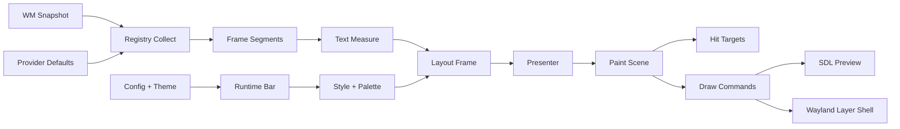
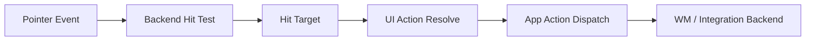

# UI Pipeline

This file is the concrete pipeline view for the current UI architecture.

## Runtime Flow

## Interaction Flow

## Current Reality

- `surface.zig` resolves placement and surface intent
- `style.zig` resolves appearance and palette policy
- `text.zig` handles measurement inputs
- `layout.zig` owns retained geometry
- `presenter.zig` assembles scene state
- `paint.zig` owns backend-neutral draw commands and hit targets
- `shell_gui.zig` and `shell_layer.zig` execute the shared scene

## Current Gap

The interaction path is only partially complete:

- hit targets exist
- semantic action resolution exists
- workspace activation dispatch exists
- full pointer/input handling and broader action execution do not yet exist
